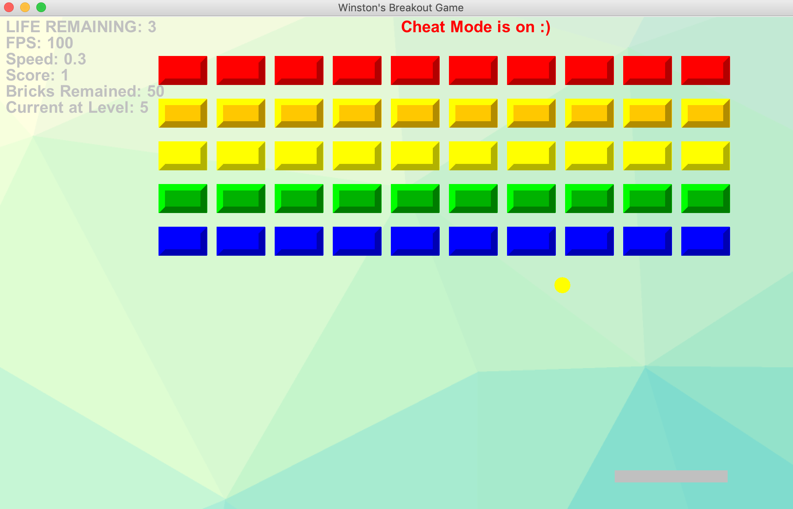

# Breakout Game
A Dynamic Breaout game with full resizing features


## How to run
- Grade needs to be installed 
- First parameter represents FPS, ranging from 25 to 50.
- Second parameter represents speed, ranging from 0.2 to 1

For example, you could type 
```
gradle run --args='50 0.3'
```

## Basic Operation

- Move the mouse to control the paddel
- Wall/Ceiling hitting adds `1 point`
- Brick Hitting adds `3 points`
- Bricks are placed in rainbow order(Pride)
- There are maximum `6 levels`, once you clear all in level 5. You have finished the game.
- Press `q` to exit at any time.
- Press `Esc` to Pause the game.

## Player Information
- A player has 3 lives
- A player can see how many bricks are remained

## Resizing - The game supports resizing 
- When the ball encounters resizing on the edge, it will be pushed attaching to the wall


- **Important Notice: To make the game smooth, when resizing the window, the bricks will be resized following the size of window. However, if you drag more, all bricks will be shrinked together**


```
I implemented this feature to guarantee the windown to resize when the user is 100% certain to resize
```

- The window will start at `(1400,668)`

- The minimum size of the window is `(1000,668)`

## keyboard Shortcut

### Speed
- `1`: Set to speed 1 (slow)
- `2`: Set to speed 2 (mid)
- `3`: Set to speed 3 (fast)

### Cheat Mode

-`c`: Turn on the cheat mode (Toggle)

### Valid under cheat mode

#### Paddle
- `4`: Paddle size 1(short) 
- `5`: Paddle size 2(mid) 
- `6`: Paddle size 3(long) 

#### Ball
- `7`: Ball size 1(small) 
- `8`: Ball size 2(mid) 
- `9`: Ball size 3(big) 

#### Game Feature
- `n`: Skip the current level and go to next (**Testing**)
- `a`: Add one additional life
- `s`: Make a screenshot of current game and Copy to `Clipboard`.

## Exit Screen

- Score will be displayed 


